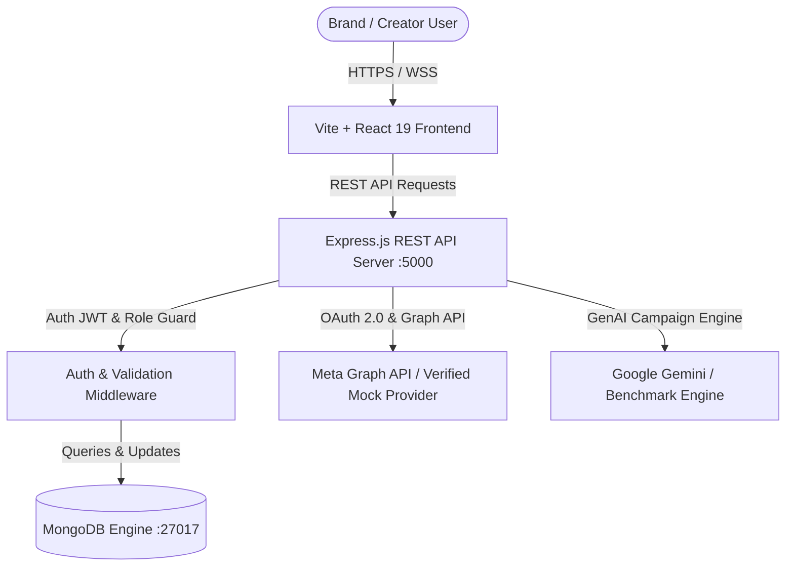
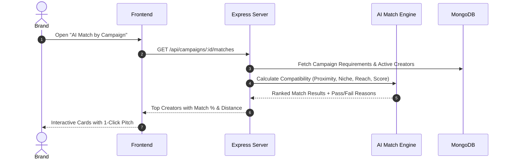
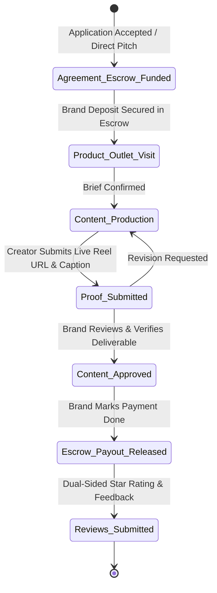
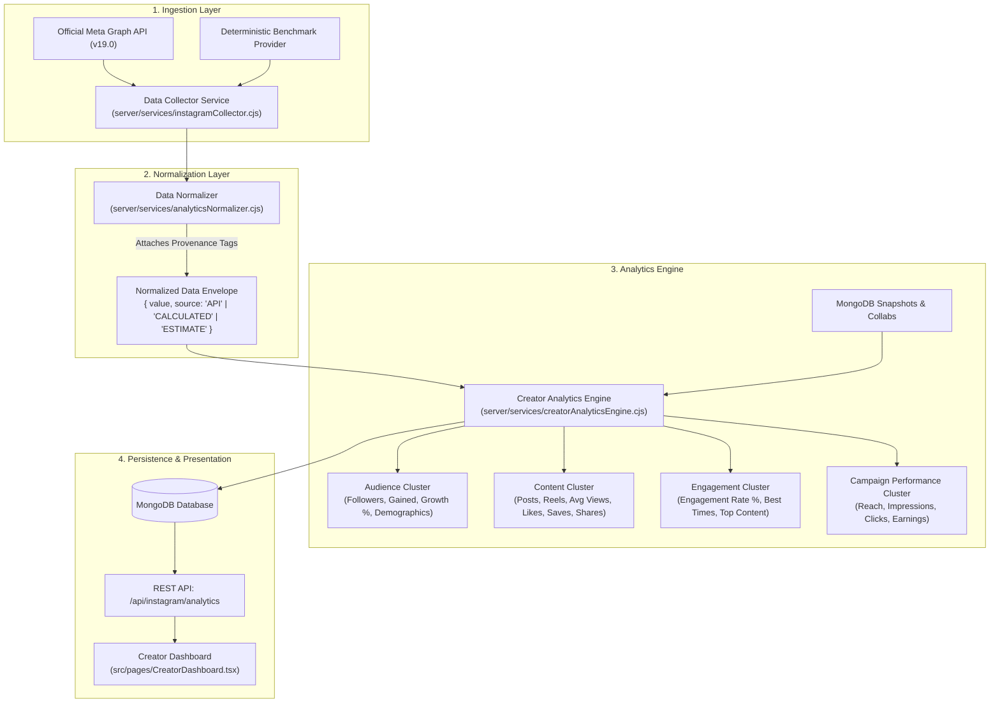

# CreaterHub — System Architecture & Technical Design Document

## 1. System Overview
**CreaterHub** is a production-grade Brand × Creator collaboration marketplace. It connects brands with micro and nano creators within hyper-local geographic radii, automating creator discovery, AI-assisted campaign generation, multi-factor compatibility scoring, real-time social metrics verification, 6-stage collaboration lifecycle tracking, and simulated milestone escrow payouts.

---

## 2. Core Architecture Components

### 2.1 Frontend Architecture (`src/`)
- **Core Framework**: React 19 with Vite and TypeScript.
- **Styling**: Tailwind CSS v4 design system with light/dark theme variables.
- **Data Visualization**: Recharts (multi-metric Area & Bar charts for Brand ROI, Campaign Reach, Creator Audience Growth).
- **Geospatial Mapping**: React-Leaflet with OpenStreetMap tiles for radius-based outlet and campaign exploration.
- **Authentication Context**: React Context API (`AuthContext.tsx`) maintaining JWT session, active role switching (`brand`, `creator`, `admin`), profile data, and real-time notification polling.

### 2.2 Backend Architecture (`server/`)
- **Runtime**: Node.js with Express.js modular routing.
- **Data Modeling**: Mongoose schemas mapping to MongoDB collections (`users`, `creators`, `brands`, `campaigns`, `applications`, `collaborations`, `reviews`, `messages`, `notifications`, `reports`).
- **Authentication**: Stateless JSON Web Tokens (`jsonwebtoken`), bcrypt password hashing, and role-based access control (`authenticateToken`, `requireAdmin`).

---

## 3. Algorithmic Engines

### 3.1 Creator Performance Scoring Engine (`0–100`)
Every creator on the platform receives a dynamic score computed across 6 core pillars:
$$\text{Score} = \sum (\text{Weight}_i \times \text{PillarScore}_i)$$

1. **Engagement Rate (25%)**: Evaluates average likes, comments, and views against industry benchmarks.
2. **Audience Growth & Velocity (20%)**: Follower trajectory and reach stability.
3. **Content Performance (20%)**: Reel view-through rate and posting cadence.
4. **Campaign Success Rate (20%)**: Historical brand rating (1-5 stars) and completed collaboration count.
5. **Profile Completeness (10%)**: Rate cards, bio, location, categories, connected social links.
6. **Delivery Reliability (5%)**: On-time content proof submission rate without revision disputes.

### 3.2 Modular AI Matchmaking Engine
When brands pitch creators or evaluate applicants for a campaign, the platform computes a matching score:
- **Location Proximity (25%)**: Haversine distance between campaign outlet and creator coordinates.
- **Engagement Compliance (25%)**: Creator engagement rate vs campaign minimum requirement.
- **Audience Fit (20%)**: Creator followers within campaign minimum and maximum limits.
- **Niche Alignment (15%)**: Category overlap between brand campaign and creator profile.
- **Creator Performance Score (10%)**: Overall platform quality rating.
- **Budget Compatibility (5%)**: Creator starting price vs reward per creator.

---

## 4. Collaboration & Escrow Lifecycle

The collaboration follows a strict 6-stage milestone state machine:

---

## 5. Creator Analytics Engine & Data Provenance Pipeline

To avoid scraping Instagram and to guarantee enterprise-level data transparency, CreaterHub implements a multi-tier analytical pipeline:

### Data Provenance Distinction
Every metric displayed to users carries explicit provenance metadata:
1. **API-Provided Data**: Raw metrics directly returned from official Meta Graph API endpoints (Total Followers, Following, Post Count, Media Likes/Comments).
2. **Calculated Data**: Algorithmic aggregations computed by CreaterHub (Monthly Follower Gain, Growth %, Engagement Rate Formula, Average Saves/Shares, Best Posting Times, Campaign Earnings).
3. **Benchmark / Estimated Data**: Demographics and reach distributions when running in reference benchmark mode.

---

## 6. Security & Data Integrity
- **Stateless Tokens**: JWTs expire automatically; secrets stored strictly in environment variables.
- **No Secret Leaks**: Clean `.env.example` provided; `.env` excluded in `.gitignore`.
- **Safe Simulated Escrow**: Clearly labeled simulation ensuring complete auditability without claiming false money movements.
- **Meta Graph API Compliance**: Transparent mock-provider fallback when production credentials are absent, strictly forbidding HTML web scraping.

